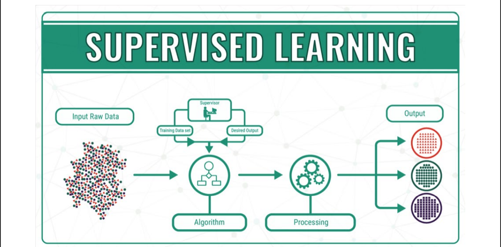

Introduction to machine learning 
Linear-regression- (Supervised learning)
-- Example of how to implement linear regression into predicition of student grades with a graph. 

-- This examples uses pandas,sklearn,numpy,pickle,matplotlib and student-mat.csv.

-- In this example pickle will save the model and will auto replace it once it has a better answer than before. 

